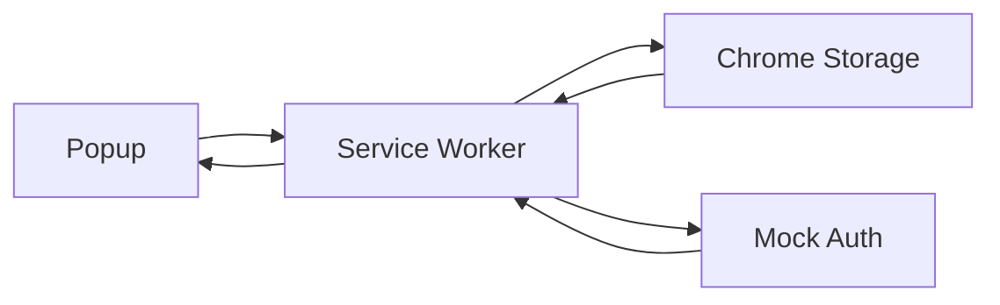
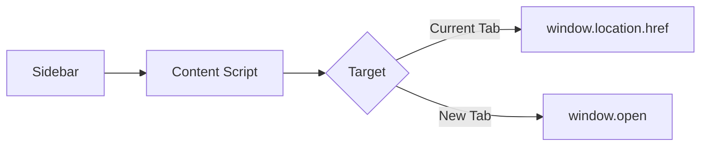
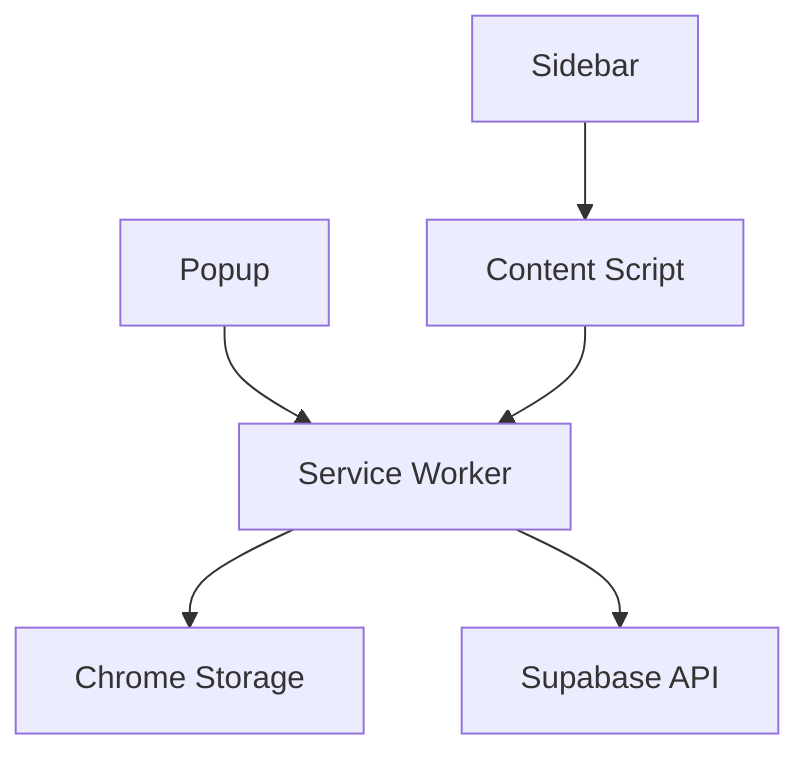

# Kit IA Emprendedor - Architecture Documentation

## 🏗️ Overview

Kit IA Emprendedor is a Chrome Extension that provides quick access to official ChatGPT models through a sleek sidebar interface. Built with vanilla JavaScript and Manifest V3.

## 📁 Project Structure

```
dist/
├── manifest.json           # Extension manifest (Manifest V3)
├── popup/
│   ├── popup.html         # Extension popup UI
│   └── popup.js           # Popup logic and authentication
├── sidebar/
│   ├── index.html         # Sidebar iframe content
│   └── sidebar.js         # Sidebar logic and GPT management
├── content/
│   └── content-script.js  # Injected script for sidebar management
├── background/
│   └── service-worker.js  # Background service worker
└── assets/
    └── icons/             # Extension icons
```

## 🔧 Component Architecture

### 1. Service Worker (`background/service-worker.js`)
**Role**: Central message hub and data persistence
- **Authentication**: Mock auth system for development
- **GPT Management**: CRUD operations for GPTs and favorites
- **Storage**: Chrome Storage API integration
- **Message Routing**: Handles all inter-component communication

**Key Functions**:
- `handleMessage()`: Central message dispatcher
- `syncGPTs()`: Loads GPT collection from Supabase/mock data
- `addFavorite()/removeFavorite()`: Favorites management
- `savePrompt()/getPrompts()`: User prompt persistence

### 2. Popup (`popup/popup.js`)
**Role**: Extension entry point and quick actions
- **Authentication UI**: Login/logout interface
- **Statistics Display**: Shows GPT counts and user info
- **Sidebar Launcher**: Opens sidebar in current tab

**Key Functions**:
- `handleOpenSidebar()`: Injects content script and opens sidebar
- `loadStats()`: Displays GPT/favorites/prompts counts
- `handleLogin()/handleLogout()`: Authentication flow

### 3. Content Script (`content/content-script.js`)
**Role**: Page injection and sidebar management
- **Sidebar Injection**: Creates and manages sidebar iframe
- **Floating Button**: Persistent toggle button
- **Resize Handling**: Sidebar width adjustment
- **Navigation**: Handles GPT opening in current/new tabs

**Key Functions**:
- `createSidebar()`: Injects sidebar iframe
- `toggleSidebar()`: Show/hide sidebar with animations
- `handleIframeMessage()`: Communication with sidebar iframe
- `insertPromptInTextarea()`: ChatGPT integration

### 4. Sidebar (`sidebar/sidebar.js`)
**Role**: Main user interface for GPT browsing
- **GPT Display**: Grid and list views for GPT collection
- **Search & Filter**: Real-time GPT filtering
- **Favorites**: Mark/unmark GPTs as favorites
- **Prompt Management**: Create, edit, delete custom prompts

**Key Functions**:
- `renderGPTCard()`: Renders GPT in grid/list format
- `handleGPTAction()`: GPT opening in current/new tab
- `createPromptModal()`: Modal for prompt creation
- `toggleFavorite()`: Favorites management

## 🔄 Data Flow

### Authentication Flow


### GPT Opening Flow


### Message Passing Architecture


## 📡 Message Types

### Service Worker Messages
- `CHECK_AUTH`: Verify authentication status
- `LOGIN/LOGOUT`: Authentication actions
- `GET_GPTS`: Retrieve GPT collection
- `SYNC_GPTS`: Refresh GPT data from source
- `ADD_FAVORITE/REMOVE_FAVORITE`: Favorites management
- `GET_PROMPTS/SAVE_PROMPT/DELETE_PROMPT`: Prompt CRUD

### Iframe Messages (Sidebar ↔ Content Script)
- `CLOSE_SIDEBAR`: Close sidebar
- `OPEN_URL`: Open URL in new tab
- `NAVIGATE_URL`: Navigate current tab
- `RESIZE_SIDEBAR`: Adjust sidebar width
- `INSERT_PROMPT`: Insert prompt in ChatGPT

## 🎨 UI Components

### Responsive Design
- **Breakpoints**: 320px, 400px, 768px
- **Sidebar Width**: 320px - 600px (resizable)
- **Mobile Adaptations**: Compact tabs, smaller buttons

### View Modes
1. **Grid View**: Card-based GPT display
2. **List View**: Compact horizontal GPT display

### Navigation Tabs
- **Todos**: All available GPTs
- **⭐ Fav**: Favorited GPTs
- **📅 Rec**: Recently used GPTs
- **📝 Mis**: User's custom prompts

## 🔐 Security Features

### Content Security Policy
- **Strict CSP**: No inline scripts in HTML
- **IIFE Modules**: All scripts wrapped in immediately invoked functions
- **Message Validation**: Origin checking for iframe messages

### Permission Model
- **Minimal Permissions**: Only required Chrome APIs
- **Storage Isolation**: Local storage per user
- **Cross-Origin Protection**: Iframe sandboxing

## 📊 Data Models

### GPT Object
```javascript
{
  id: string,           // Unique identifier
  name: string,         // Display name
  description: string,  // GPT description
  icon: string,         // Emoji icon
  category: string,     // Category (general, creative, etc.)
  url: string,          // ChatGPT URL
  official: boolean     // Official GPT flag
}
```

### Prompt Object
```javascript
{
  id: string,           // Auto-generated ID
  title: string,        // User-defined title
  content: string,      // Prompt content
  createdAt: string,    // ISO timestamp
  usageCount: number    // Usage counter
}
```

### User State
```javascript
{
  currentTab: string,   // Active tab (all/favorites/recent/prompts)
  currentView: string,  // View mode (grid/list)
  searchQuery: string,  // Current search filter
  gpts: Array,          // Loaded GPT collection
  favorites: Array,     // User's favorite GPT IDs
  prompts: Array        // User's custom prompts
}
```

## 🚀 Performance Optimizations

### Efficient Rendering
- **Virtual DOM Avoidance**: Direct DOM manipulation
- **Event Delegation**: Minimal event listeners
- **Lazy Loading**: Load data on demand

### Memory Management
- **Cleanup**: Proper event listener removal
- **State Management**: Minimal state persistence
- **Resource Disposal**: iframe cleanup on page unload

## 🔄 Error Handling

### Graceful Degradation
- **Fallback Clipboard**: execCommand for restricted contexts
- **Cross-Origin Resilience**: Try-catch for iframe access
- **Network Failures**: Local fallbacks for data

### User Feedback
- **Toast Notifications**: Immediate action feedback
- **Error States**: Clear error messaging
- **Loading States**: Visual loading indicators

## 🧪 Testing Strategy

### Manual Testing Checklist
- [ ] Extension loading in dev mode
- [ ] Popup functionality on all page types
- [ ] Sidebar injection and display
- [ ] GPT opening in current/new tabs
- [ ] Favorites add/remove
- [ ] Prompt creation/deletion
- [ ] Responsive behavior at different widths
- [ ] Cross-origin compatibility

### Automated Testing (Planned)
- **Playwright E2E**: Extension loading and core flows
- **Jest Unit Tests**: Individual component testing
- **Performance Tests**: Memory and CPU usage

---

## 📝 Development Notes

### Build Process
- **No Build System**: Direct JavaScript for simplicity
- **Manual Optimization**: Hand-optimized for <50KB target
- **Version Control**: Git-based versioning

### Deployment
- **Chrome Web Store**: Production deployment
- **Development**: Load unpacked in Chrome
- **Updates**: Incremental version bumps

This architecture ensures scalability, maintainability, and optimal user experience while keeping the extension lightweight and performant.