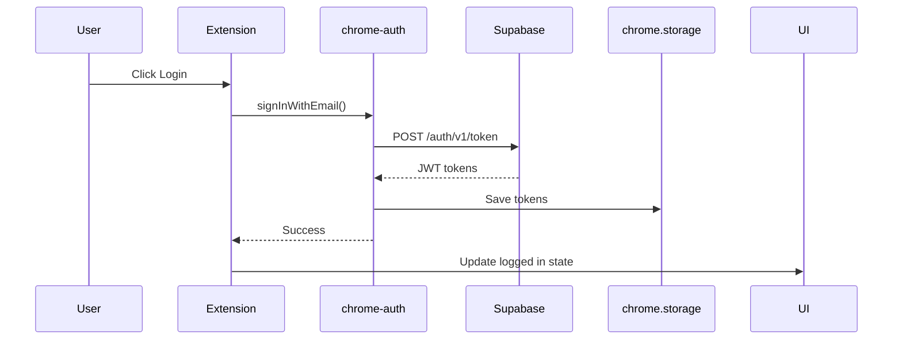
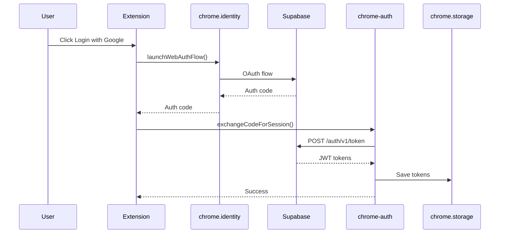

# 📝 PRD - Sistema de Autenticación para Chrome Extension

## 1. VISIÓN GENERAL

### 1.1 Objetivo
Implementar un sistema de autenticación robusto y compatible con Chrome Extensions Manifest V3 que permita a los usuarios de Kit IA Emprendedor autenticarse de forma segura usando Supabase.

### 1.2 Problema
La implementación actual usa el SDK web estándar de Supabase que no es compatible con las restricciones de seguridad de Chrome Extensions, causando timeouts y fallos de autenticación.

### 1.3 Solución
Crear un módulo de autenticación específico para Chrome Extensions que use las APIs correctas (chrome.identity, chrome.storage) manteniendo compatibilidad con Supabase.

## 2. REQUISITOS FUNCIONALES

### 2.1 Autenticación
- **RF01**: Login con email/password
- **RF02**: Login con OAuth (Google, GitHub)
- **RF03**: Registro de nuevos usuarios
- **RF04**: Recuperación de contraseña
- **RF05**: Logout
- **RF06**: Refresh automático de tokens

### 2.2 Gestión de Sesión
- **RF07**: Persistencia de sesión entre reinicios
- **RF08**: Detección de sesión expirada
- **RF09**: Multi-tab sync de estado auth
- **RF10**: Indicador visual de estado auth

### 2.3 Seguridad
- **RF11**: Tokens almacenados de forma segura
- **RF12**: No exponer secrets en código
- **RF13**: Validación de tokens antes de uso
- **RF14**: Limpieza de datos al logout

## 3. REQUISITOS NO FUNCIONALES

### 3.1 Performance
- **RNF01**: Login < 3 segundos
- **RNF02**: Check de sesión < 100ms
- **RNF03**: No bloquear UI durante auth

### 3.2 Compatibilidad
- **RNF04**: Chrome 88+
- **RNF05**: Manifest V3 compliant
- **RNF06**: Supabase JS SDK v2+

### 3.3 Mantenibilidad
- **RNF07**: Código modular y testeable
- **RNF08**: Documentación inline completa
- **RNF09**: Logs de debug configurables
- **RNF10**: Manejo de errores robusto

## 4. ARQUITECTURA TÉCNICA

### 4.1 Componentes
```
chrome-auth.js
├── ChromeStorageAdapter    # Adaptador para chrome.storage
├── ChromeAuthClient        # Cliente auth personalizado
├── TokenManager           # Gestión de tokens
└── SessionManager         # Gestión de sesiones
```

### 4.2 Flujo de Autenticación

#### Email/Password


#### OAuth


### 4.3 Storage Schema
```javascript
{
  "supabase_auth": {
    "access_token": "string",
    "refresh_token": "string", 
    "expires_at": "number",
    "user": {
      "id": "string",
      "email": "string",
      "metadata": {}
    }
  }
}
```

## 5. CASOS DE USO DETALLADOS

### UC01: Primer Login
1. Usuario instala extensión
2. Abre side panel
3. Ve pantalla de login
4. Ingresa credenciales
5. Sistema valida con Supabase
6. Guarda tokens en chrome.storage
7. Muestra UI autenticada

### UC02: Sesión Persistente
1. Usuario cierra Chrome
2. Abre Chrome nuevamente
3. Abre extensión
4. Sistema detecta tokens guardados
5. Valida tokens con Supabase
6. Si válidos, muestra UI autenticada
7. Si inválidos, intenta refresh
8. Si refresh falla, muestra login

### UC03: OAuth Login
1. Usuario click "Login with Google"
2. Se abre popup de Google
3. Usuario autoriza
4. Popup se cierra
5. Extensión recibe código
6. Intercambia por tokens
7. Guarda y muestra UI auth

## 6. PLAN DE IMPLEMENTACIÓN

### Fase 1: Core Auth (2 días)
- [ ] Crear chrome-auth.js base
- [ ] Implementar ChromeStorageAdapter
- [ ] Login email/password
- [ ] Tests unitarios

### Fase 2: OAuth (1 día)
- [ ] Configurar chrome.identity
- [ ] Implementar OAuth flow
- [ ] Test con Google/GitHub

### Fase 3: Polish (1 día)
- [ ] Auto-refresh tokens
- [ ] Multi-tab sync
- [ ] Error handling mejorado
- [ ] Documentación

## 7. CRITERIOS DE ACEPTACIÓN

### Para Login Email/Password
- GIVEN usuario con cuenta existente
- WHEN ingresa credenciales válidas
- THEN debe autenticarse en < 3 segundos
- AND tokens deben guardarse en chrome.storage
- AND UI debe actualizarse a estado auth

### Para OAuth
- GIVEN usuario sin cuenta
- WHEN hace click en "Login with Google"
- THEN debe abrir popup de OAuth
- AND al autorizar debe crear cuenta
- AND debe quedar autenticado

### Para Persistencia
- GIVEN usuario autenticado
- WHEN cierra y abre Chrome
- THEN debe mantener sesión
- AND no debe pedir login nuevamente

## 8. RIESGOS

| Riesgo | Mitigación |
|--------|------------|
| Chrome cambia APIs | Abstraer APIs en interfaces |
| Supabase cambia auth | Versionar SDK, tests E2E |
| Tokens filtrados | Encriptar en storage |
| Rate limits | Implementar retry logic |

## 9. MÉTRICAS

- Login success rate > 95%
- Tiempo promedio login < 3s
- Session persistence > 99%
- Error rate < 1%

## 10. DOCUMENTACIÓN

- README con guía de setup
- Ejemplos de código
- Troubleshooting guide
- Video tutorial

---
**Estado**: Pendiente de implementación
**Prioridad**: CRÍTICA - Bloqueador principal